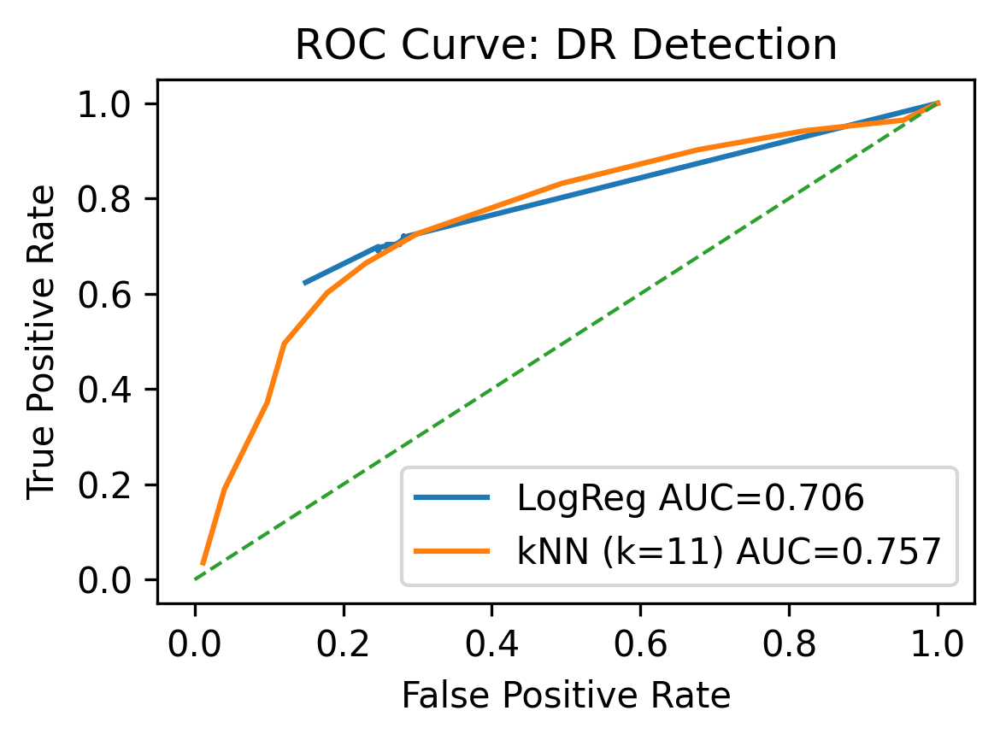

Automated Detection of Diabetic Retinopathy
Implementation Project — Logistic Regression and K-Nearest Neighbors (From Scratch)
Project Overview

This project detects Diabetic Retinopathy (DR) — a diabetes-related eye disease that can cause blindness — using two classical machine learning algorithms implemented entirely from scratch using NumPy:
Logistic Regression and K-Nearest Neighbors (KNN).

The goal was to demonstrate how even simple, interpretable models can classify medical images effectively when paired with proper preprocessing and evaluation.

🩺 Problem Statement

Diabetic Retinopathy (DR) progressively damages retinal blood vessels, leading to irreversible vision loss if not detected early.

Manual diagnosis from fundus images is time-consuming and prone to human error.

Objective: Develop an automated ML-based detection system to classify retina images as
🟢 No DR (Healthy) or 🔴 DR (Diseased).

Algorithms implemented from scratch (no scikit-learn, no TensorFlow).

Dataset Information

Dataset Name: RetinaMNIST
 (part of the MedMNIST collection)

Property	Details
Total Images	≈ 1,600 retinal fundus photographs
Image Type	PNG
Labels	DR severity levels (0–4)
Task Type	Binary Classification
Conversion	0 → No DR, 1–4 → DR
Split	Train 1080 • Validation 120 • Test 400

All images were resized to 64×64 pixels, converted to grayscale, and normalized between 0 and 1.

Preprocessing Steps

Grayscale Conversion – Simplified input (1 channel).

Resizing – Standardized all images to 64×64.

Flattening – Converted each image into a vector of 4,096 features.

Normalization – Scaled pixels between 0 and 1.

Z-score Standardization – Standardized using training set mean (μ) and std (σ).

✅ Result: A consistent, clean dataset ready for ML model input.

🧩 Algorithms Implemented
🔹 Logistic Regression

Linear model predicting probability of DR.

Activation: Sigmoid Function​

Optimization: Gradient Descent

Loss Function: Binary Cross-Entropy (BCE)

Regularization: L2 penalty to prevent overfitting.

K-Nearest Neighbors (KNN)

Non-parametric algorithm using Euclidean distance.

Prediction based on majority vote among nearest k samples.

Best k = 11 determined using validation F1-score.

Implementation Details

Language: Python

Libraries Used: NumPy, Matplotlib, Pandas

Platform: Google Colab

Both algorithms were manually coded using matrix operations in NumPy.
No pre-built ML frameworks (like scikit-learn or TensorFlow) were used.

Evaluation Metrics

The models were evaluated on the test set (400 unseen images) using the following metrics:

Accuracy

Precision

Recall

F1 Score

ROC–AUC

Results Summary
Metric	Logistic Regression	KNN (k=11)
Accuracy	0.718	0.710
Precision	0.770	0.789
Recall	0.712	0.664
F1 Score	0.740	0.721
AUC	0.707	0.757
📈 ROC Curve

  

🔍 Confusion Matrix
Model	Confusion Matrix
Logistic Regression	[[126 48], [65 161]]
KNN (k=11)	[[134 40], [76 150]]
💬 Key Findings

Both models achieved ~71% accuracy on the test set.

Logistic Regression → Higher recall → Better at identifying DR cases.

KNN → Higher precision and AUC → Better at reducing false positives.

Confirms that classical algorithms can perform reliable DR screening even without deep learning.

🚀 Future Work

Extend implementation to a Convolutional Neural Network (CNN).

Experiment with larger datasets (EyePACS, APTOS 2019).

Integrate Grad-CAM or Explainable AI (XAI) for model transparency.

📂 File Structure
📁 DR-Detection-From-Scratch/
 ┣ 📜 dr_project.ipynb                ← Main Colab notebook
 ┣ 📈 roc_curve.png                   ← ROC visualization
 ┣ 📊 confusion_matrix.png            ← Confusion matrix image
 ┣ 📘 README.md                       ← Project documentation
 ┗ 🧾 diabetic_retinopathy_project.zip← Compressed version (optional)

Author

Megha John Babu
School of Computer Science and Engineering
California State University, San Bernardino

📧 Email: meghajohnbabu@csusb.edu

🔗 GitHub: github.com/MeghaJohnBabu/DR-Detection-From-Scratch
